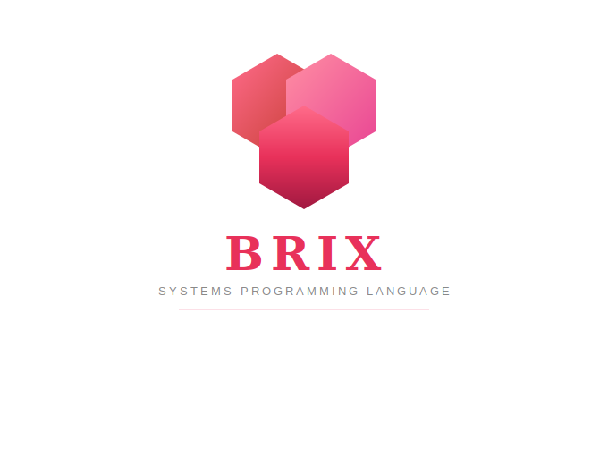

<p align="center">
  
  <h1 align="center">Brix</h1>
  <p align="center">
    <strong>A modern systems programming language — fast, safe, and expressive.</strong>
  </p>
</p>

<p align="center">
  <a href="https://github.com/The-Brix-Foundation/brix/actions"></a>
  <a href="LICENSE-MIT"></a>
</p>

---

> **⚠️ Brix is under active development and is not yet ready for production use.**

## About

Brix is a compiled, statically-typed systems programming language. The compiler (`brixc`) is written in Rust and targets LLVM for native code generation.

This project is maintained by [The Brix Foundation](https://github.com/The-Brix-Foundation).

## Building from Source

### Prerequisites

- [Rust](https://rustup.rs/) (stable, latest)
- [LLVM 17+](https://llvm.org/) (for code generation)
- A C linker (gcc or clang)

### Build

```bash
git clone https://github.com/The-Brix-Foundation/brix.git
cd brix
cargo build
```

### Run Tests

```bash
cargo test
```

## Project Structure

```
brix/
├── src/
│   ├── main.rs          # CLI entry point
│   ├── lib.rs           # Compiler library root
│   ├── lexer/           # Tokenizer
│   ├── parser/          # Parser and AST
│   ├── semantic/        # Type checking, name resolution
│   ├── codegen/         # LLVM IR emission
│   └── errors/          # Diagnostics and error reporting
└── tests/               # Test suite
```

## Roadmap

- [x] Project setup
- [ ] Lexer / tokenizer
- [ ] Parser / AST
- [ ] Type checker
- [ ] LLVM codegen
- [ ] Hello World compiles
- [ ] Variables and arithmetic
- [ ] Control flow
- [ ] Functions
- [ ] Arrays and strings
- [ ] Structs and enums
- [ ] **v1.0 — solve basic DSA problems in Brix**

## Related Repositories

| Repo | Description |
|------|-------------|
| [`brix-std`](https://github.com/The-Brix-Foundation/brix-std) | Standard library |
| [`brix-spec`](https://github.com/The-Brix-Foundation/brix-spec) | Language specification |
| [`brix-examples`](https://github.com/The-Brix-Foundation/brix-examples) | Example programs |

## Contributing

We welcome contributions! Please read [CONTRIBUTING.md](CONTRIBUTING.md) before submitting a pull request.

## License

Licensed under either of

- Apache License, Version 2.0 ([LICENSE-APACHE](LICENSE-APACHE) or <http://www.apache.org/licenses/LICENSE-2.0>)
- MIT license ([LICENSE-MIT](LICENSE-MIT) or <http://opensource.org/licenses/MIT>)

at your option.

### Contribution

Unless you explicitly state otherwise, any contribution intentionally submitted for inclusion in the work by you, as defined in the Apache-2.0 license, shall be dual licensed as above, without any additional terms or conditions.
